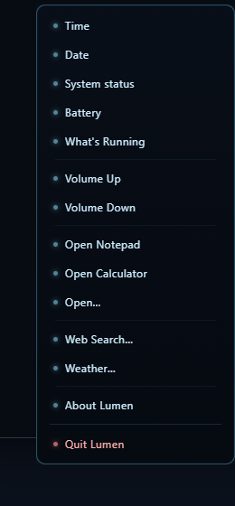

# Lumen — Desktop Orb

**A tiny voice orb that lives on your desktop.**
Right-click it for a menu of quick commands — the time, your system status,
the weather, a web search, opening any app by name — each one answered
**instantly** and **spoken out loud** in a real voice.

> **No account. No subscription. No language model. No cloud.**
> Just a small floating light that answers fast and stays out of your way.

---

### Highlights

- 🔵 **A living particle sphere** — a soft glowing orb that drifts at rest and swells into a liquid ripple while it talks.
- ⚡ **Instant answers** — every quick command is a deterministic lookup or action, not a model "thinking". Nothing to wait for.
- 🎙️ **A real spoken voice** — a proper on-device neural voice, not a robotic system TTS.
- 🖱️ **Right-click for everything** — a clean custom menu is the entire interface. No windows to manage, no settings to dig through.
- 🌦️ **Weather, web search, open any app by name** — the few commands that need a word or two just ask for it inline.
- 🪶 **Small and quiet** — no language model, no multi-gigabyte download, no background service. It only ever downloads the voice itself, once.

---

### Screenshots

<table>
<tr>
<td width="50%">

**The orb** — idle, drifting quietly on the desktop.

</td>
<td width="50%">

**Right-click menu** — every command, one click away.

</td>
</tr>
</table>

---

### Download & install

1. Open the [**Releases**](../../releases/latest) page and download
   `Lumen Setup <version>.exe`.
2. Run it. The installer is **per-user** — it needs **no administrator rights**.
3. Lumen appears as a small glowing orb in the bottom-right of your screen.

> **First launch:** the installer isn't code-signed, so Windows SmartScreen may
> show *"Windows protected your PC"*. Click **More info → Run anyway**. This is
> normal for a free, independent app.

New here? The [**Welcome guide**](WELCOME.md) walks through setup and your
first command with nothing assumed.

**No other setup needed** — unlike bigger AI assistants, Lumen has no model to
download or install first. The very first spoken reply downloads a small
voice model (a few hundred MB, once); everything after that is instant and
fully offline.

---

### Documentation

| Document | What it covers |
|---|---|
| [Welcome guide](WELCOME.md) | Beginner, step-by-step: install, run, your first command |
| [Command guide](GUIDE.md) | Every command, what it does, and how to use it |
| [License](LICENSE) | MIT — free to use |

---

### System requirements

| | Minimum |
|---|---|
| **OS** | Windows 10 / 11, 64-bit |
| **RAM** | 4 GB |
| **Free disk** | ~500 MB (app + voice model) |
| **Internet** | For the one-time voice download and the Weather / Web Search commands only |

Everything else — the clock, system status, opening apps, the menu itself —
works fully offline.

---

### Privacy at a glance

- **No accounts, no API keys, no telemetry, no analytics, no auto-update.**
- **No language model runs anywhere** — every command is a small, fixed
  routine, not an AI deciding what to do.
- The voice (text-to-speech) runs **on-device**, after a one-time download.
- The only network use, ever: that one-time voice download, and the two
  commands that are explicitly about the outside world (**Weather**,
  **Web Search**).

---

### License

MIT — free to use, copy, and share. See [LICENSE](LICENSE).

*Not affiliated with, sponsored by, or associated with any film, game,
franchise, or brand. "Lumen" is simply Latin for "light".*
